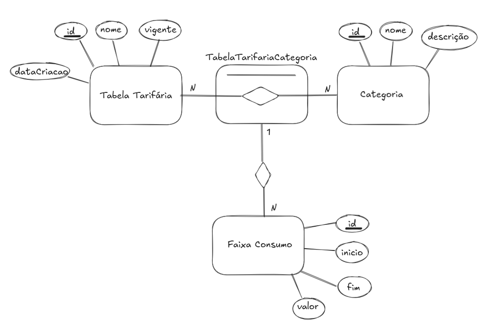
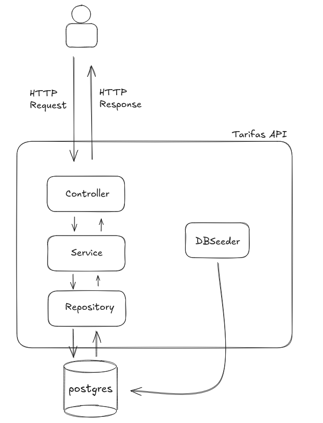

# Desafio Técnico RAS - API de Tabela Tarifária de água

Este repositório contém a aplicação desenvolvida durante o desafio técnico do processo seletivo de Desenvolvedor de Sistemas Jr.

O desafio propõe a criação de uma API utilizando Spring Boot + PostgreSQL de criação e gerência de tabelas tarifárias.

---

## Modelagem de Domínio
Segue o [Modelo Entidade Relacionamento](https://pt.wikipedia.org/wiki/Modelo_entidade_relacionamento) proposto para essa atividade



- **Tabela Tarifária**: Entidade central da aplicação, a tabela armazenará dados básicos da tabela tarifária, como nome, data de criação, e vigência.
  Para o atributo `vigencia` especificamente, ele foi adicionado para registrar qual a tabela ativa no momento, pois a aplicação permite a criação de múltiplas tabelas tarifárias, e a ativa é sempre a última cadastrada.
- **Categoria**: Entidade que representa as diferentes categorias cadastradas. Contém atributos básicos como nome(unique) e descrição
- **TabelaTarifariaCategoria**: Uma [Entidade Associativa](https://pt.wikipedia.org/wiki/Entidade_associativa) que representa a ligação entre as entidades `Tabela Tarifária` e `Categoria` como relacionamento muitos para muitos(N:N).
- **Faixa Consumo**: Entidade que representa uma faixa de consumo, que se relaciona com `TabelaTarifariaCategoria`
---

##  Arquitetura do Sistema
Segue um diagrama básico da arquitetura da aplicação



- **Controllers**: Camada que recebe a requisição HTTP, responsável por chamar a camada de serviço e retornar o JSON adequado.
- **Services**: Camada responsável pelas regras de negócio da aplicação, podendo chamar a camada de persistência para interagir com o banco
- **Repository**: Camada responsável por interagir com o banco de dados.
- **DBSeeder**: Camada adicional que popula o banco com as categorias padrão especificadas no projeto, como: COMERCIAL, INDUSTRIAL, PARTICULAR e PÚBLICO

---

## Deploy

Atualmente, a API está deployada no Render via este link: https://desafio-tecnico-ras.onrender.com/swagger-ui/index.html

O banco utilizado para esse deploy é o [Supasabe](https://supabase.com/)

**Observação**: Como a aplicação está hospedada no plano gratuito do Render, na primeira vez que for acessada (ou após um período de inatividade), pode ser exibida uma tela de carregamento enquanto a API é inicializada. Isso ocorre devido ao cold start característico do plano free.

---

## Rodar local

Para rodar a API localmente, é necessário instalar o [Docker](https://docs.docker.com/desktop/setup/install/windows-install/)

Uma vez instalado, basta clonar este repositório, e na pasta do projeto rodar:
```bash
docker compose up -d --build
```

Quando os containers da api e do banco estiverem rodando, basta acessar o seguinte link para interagir com o Swagger da API: http://localhost:8080/swagger-ui/index.html

### Acesso ao banco local

Para acessar localmente o banco, é recomendável utilizar alguma UI de gerenciamento de banco(recomendo [DBeaver](https://dbeaver.io/) ou [pgAdmin4](https://www.pgadmin.org/))

Utilize os seguintes campos para se conectar ao banco:

- Host: localhost
- Database: app_db
- Username: user
- Password: password
